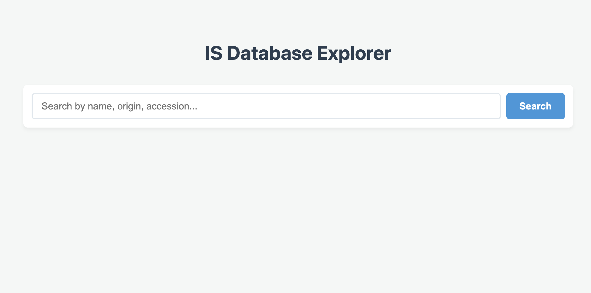
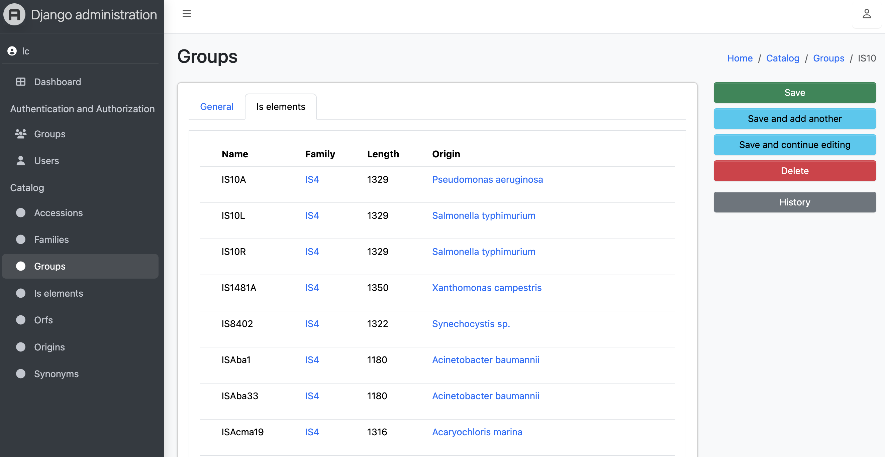

# Django IS Database Explorer

A searchable, robut and version-controlled Django backend designed to manage and index the ISFinder dataset (5,600+ IS elements). 
Note on Upstream Security: These Data are fetched from the official ISFinder database. 
Since that host uses a legacy HTTP protocol rather than HTTPS, please ensure your local environment is configured to allow a secure connection.

This project transforms flat biological data into a relational database and layers a full-text search engine on top using Haystack and Whoosh
## Features

* **Full-Text Search:** Search across name, family, group, synonym, origins (Bacterial genus or species), and accession numbers without an SQL database, powered by django-haystack and an inverted index
* **Relational Architecture:** Data models separating ISElement, Family, Origin (Bacterial species), and Accession to prevent data duplication
* **Data Undo:** Audit logging and version control in the Django Admin panel using django-simple-history. Every edit is tracked and can be instantly reverted
* **UI:** Responsive data table interface for scanning high-density scientific results
## Stack

* **Backend:** Python, Django 
* **Database:** SQLite (development) / PostgreSQL (production)
* **Search Engine:** django-haystack, Whoosh
* **Data Tracking:** django-simple-history

## Screenshots
Search Interface  

  

Admin Interface  



## For a local Setup & Installation

Follow these steps to spin up the database and search engine on your local machine.

### Clone and Install with conda (or mamba)
```bash
git clone https://github.com/LCrossman/ISdata.git
cd ISdata
conda env create -f environment.yml
conda activate isdata_env
```
## setup the database schema
```bash
python manage.py migrate
```
## import the data with:
```bash
python manage.py import_csv IS_data.csv
```
## generate the haystack index
```bash
python manage.py rebuild_index
```
## start the development server
```bash
python manage.py runserver
```
The application will be available at [http://127.0.0.1:8000](http://127.0.0.1:8000)
Go to localhost: http://127.0.0.1:8000/index/ to view the application, or http://127.0.0.1:8000/search/ to query the ISFinder dataset

** Optional: Accessing the Admin Panel**
To view the imported data (and edit) through the Django admin interface, you will need to create a superuser account:
```bash
python manage.py createsuperuser
```
Follow prompts to set an admin username and password and login at http://127.0.0.1:8000/admin/
